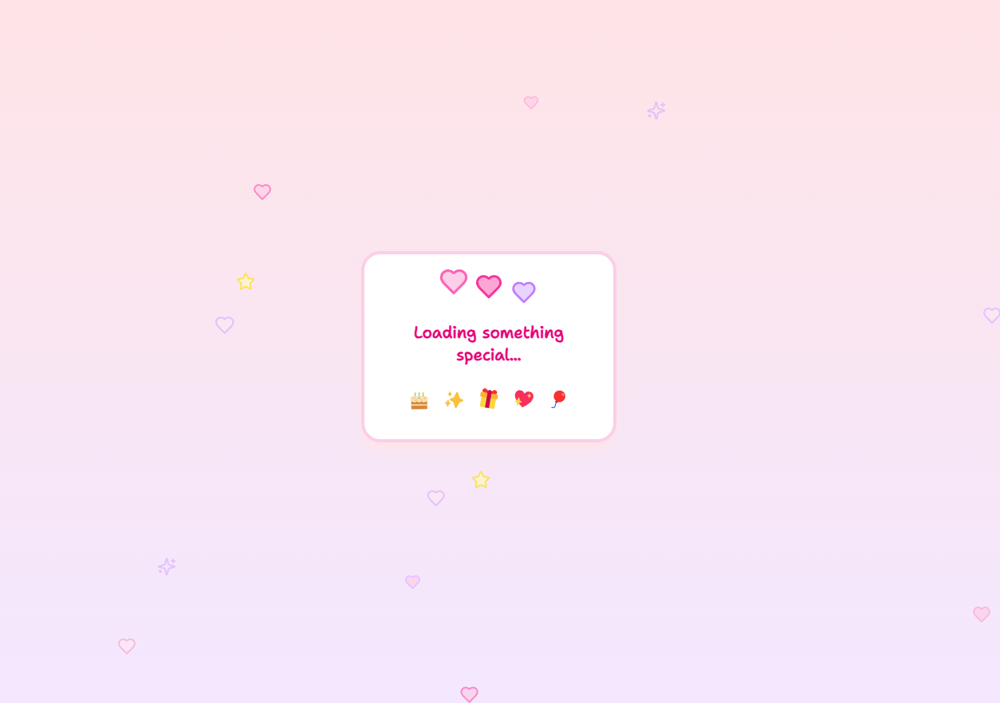
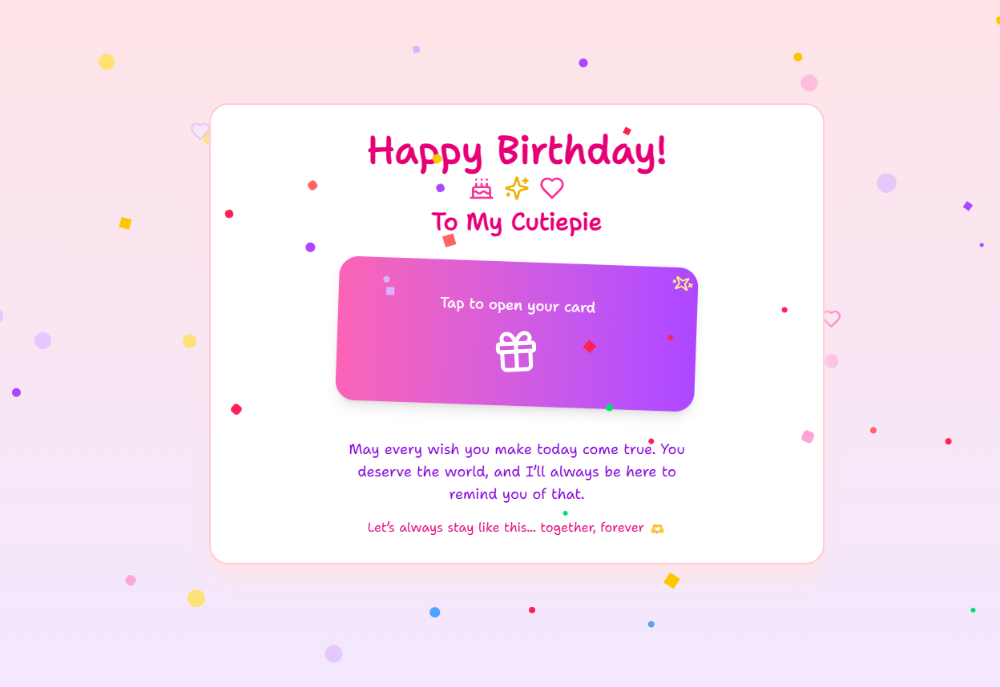

# 💌 A Special Invitation for You 💝

This is more than just a website — it's a digital love letter and an invitation to create beautiful memories together. Built with **Next.js, Tailwind CSS, Framer Motion**, and **Lucide Icons**, this is my way of asking you out in a way that's as special as you are. ✨

---

## 💖 Let's Make It a Date!

> **POV:** Some moments are too special for ordinary invitations.

What's inside this digital invitation:

- A heartfelt message just for you 💌
- A special surprise waiting to be discovered 🎁
- Smooth animations that can't hide my excitement ✨
- My way of saying "I'd love to take you out" in code 💻

---

## 📸 Let's Connect

Can't wait to see you! Follow me on Instagram: [@nhrich4](https://www.instagram.com/nhrich4/)

---

*Made with ❤️ by NH Rich*

This was created as part of an emotional reel where the journey begins with a few lines of code in VS Code and ends with a beautiful surprise on the browser.

---

## Screenshots:

1. **Loader Page**
   

2. **Countdown Page**
   

3. **Happy Birthday Message Screen**
   

---

## 🛠️ Built With

- [Next.js](https://nextjs.org/)
- [Tailwind CSS](https://tailwindcss.com/)
- [Framer Motion](https://www.framer.com/motion/)
- [Lucide Icons](https://lucide.dev/)

---

## 🔧 Setup

To run this project locally:

```bash
git clone https://github.com/Anuj579/birthday-site.git
cd birthday-site
npm install
npm run dev
```

Make sure to update the target date in `Home` component if you want to reuse this.

---

## 🌐 Connect with Me

Follow for more such creative and code-based content!

- 📸 **Instagram**: [@nhrich4](https://instagram.com/nhrich4)
- 🎥 **YouTube**: [@nhrich4](https://youtube.com/@nhrich4)
- 🐦 **Twitter/X**: [@nhrich4](https://twitter.com/nhrich4)
- 💼 **LinkedIn**: [NHRich](https://linkedin.com/in/nhrich4)

---

Thanks for checking out this project! If you liked it, consider giving it a ⭐️ on GitHub and sharing the reel ❤️
